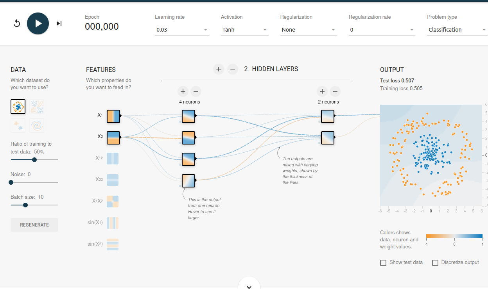
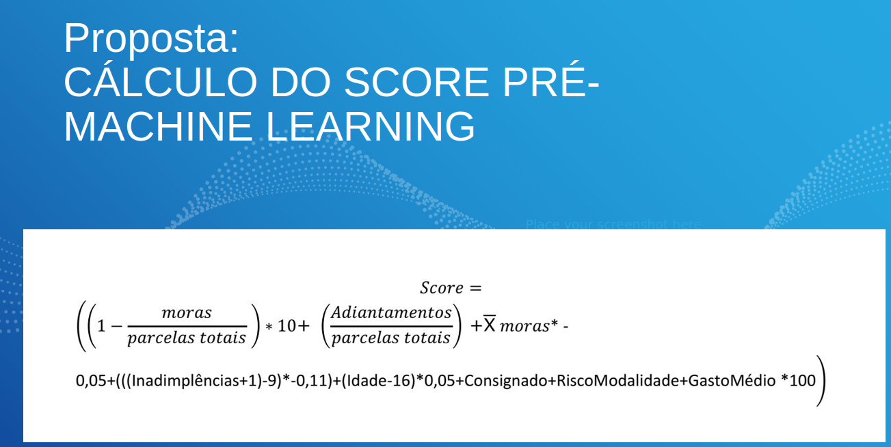
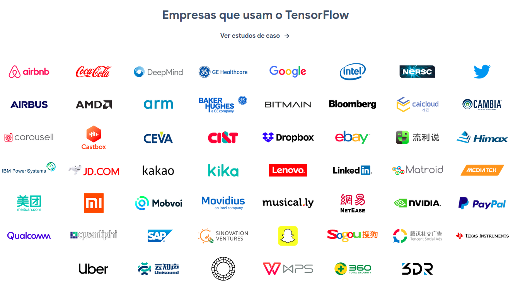

## PORTFOLIO ACADÊMICO - PROJETOS INTEGRADORES:

[SEMESTRE-01-2019.2 - *Python-Sqlite3 Web Scrapper - Monitor de Segurança Pública*](https://github.com/ODAGAMMXIX/PFOLIO1_DANZO) 

[SEMESTRE-02-2020.1 - *Java-MySQL Stand Alone App - Gráfico de GANTT para Gestores*](https://github.com/ODAGAMMXIX/PFOLIO2_GANTT)

## [SEMESTRE-03-2020.2 - *Java-Oracle - Cadastro Positivo e Desbancarizados*](https://github.com/ODAGAMMXIX/PFOLIO3_VALCODE)

[SEMESTRE-04-2021.1 - *Java-Oracle API - Recrutamento por Geolocalização et al.*](https://github.com/ODAGAMMXIX/PFOLIO4_JOBNATION)

[SEMESTRE-05-2021.2 - *Java-Pentaho-My(SQL)Server-MongoDB - Engajamento Estudantil*](https://github.com/ODAGAMMXIX/PFOLIO4_JOBNATION)

[SEMESTRE-06-2022.1 - *Python-MongoDB-LGPD opt-in opt-out ou Análise de Dados Eleitorais*](https://github.com/ODAGAMMXIX/PFOLIO4_JOBNATION)

***

<h1 align="center">[Java-Oracle - Cadastro Positivo e Desbancarizados]</h1>

 
 

 
 [`vídeo da aplicação`]<https://youtu.be/w2c7l4HPcSs>

<h5 align="center">[BÔNUS SOBRE DESBANCARIZADOS]</h5>

 
 

 
 <[`vídeo-bônus`](https://youtu.be/g0p9_XtqxcU)>

# I - RESUMO DO PROJETO 

Empresa parceira SPC Brasil figurou como cliente.

**OBJETIVO:** criar um aplicação capaz de atrair e manter  usuários cadastrados no programa *Cadastro Positivo*. Diferente do cadastro negativo, nessa modalidade, a empresa não vê apenas o que você deixou de pagar, mas o conjunto completo. Ou seja, ela vê tanto o que você pagou quanto o que você ainda não pagou. A partir da análise desses pagamentos, é calculado o seu *score* de crédito.

Propusemos uma ferramenta com Monetização e Fidelização como atrativo para o usuário.

**DIFERENCIAIS DA PLATAFORMA:**

:arrow_right:  **MONETIZAÇÃO:** TODAS AS FUNÇÕES SÃO MONETIZÁVEIS;

:arrow_right:  **FIDELIZAÇÃO** pela **GAMIFICAÇÃO** POR TODO O AMBIENTE EM BUSCA DA FIDELIZAÇÃO;

:arrow_right:  **EDUCAÇÃO FINANCEIRA:** É CAPAZ DE AJUDAR O USUÁRIO A SUPERAR-SE E MELHORAR DE VIDA;

:arrow_right:  **DESBANCARIZADOS:** TRAZ A REALIDADE DO COMÉRCIO JÁ EXISTENTE  PARA DENTRO DA PLATAFORMA;

### **ARQUITETURA**

#### 1) Tela de Login + Tratamento de Erros: Cadastro.

<h4 align="center">(Usuário cadastra-se voluntariamente)</h4>

#### 1.1) Tela de Login + Tratamento de Erros: Cadastro Correto.

#### 1.2) Tela de Login + Tratamento de Erros: Controles.

<h4 align="center">(Controle e validação de e-mails/CPF)</h4>

#### 1.3) Tela de Login + Tratamento de Erros: CPF.

<h4 align="center">(Validação de CPF/Senha)</h4>

#### 2) Tela de Entrada: DASH BOARD.

<h4 align="center">(Dash com as informações e histórico do Score do usuário)</h4>

#### 3) Minha Conta - permissões de acesso aos meus dados:

<h4 align="center">(Empoderamento do usuário)</h4>

- Objetivo 01: Fidelização (Quanto mais ele permite, mais pontos ganha).

- Objetivo 02: Monetização, pela qualidade dos dados a serem consultados;

- Objetivo 03: Fidelização do CONSULENTE/CONCEDENTE de crédito;

- Objetivo 04: Gamificação para o usuário.

#### 4) Meus Pontos - Minhas Trocas:

<h4 align="center">(Vantagens ao Usuário)</h4>

- Objetivo 01: Fidelização;

- Objetivo 02: Gamificação;

- Objetivo 03: Monetização, podendo conectar aqui um programa de fidelidade existente.

#### 5) Meus Pontos com HELPER - Educação Financeira:

<h4 align="center">(Troca pontos por cursos)</h4>

- Objetivo 01: Fidelização;

- Objetivo 02: Gamificação;

- Objetivo 03: Monetização, podendo conectar aqui uma legaltech para intermediar acordos, "feirão" para limpar nome etc.

#### 6) DESBANCARIZADOS - Criação de movimentos para microcrédito:

<h4 align="center">(Certificação cruzada (estabelecimento e consumidores) para capturar dados atualmente inexistentes, fortalecer laços nessa faixa de renda, possibilitar microcrédito em estabelecimentos nesses locais)</h4>

- Objetivo 01: Atração pela eliminação de planilha e carnês em papel;

- Objetivo 02: Impulsionar a geração de dados nesse segmento do mercado; essas transações já existem na vida real, porém, não são capturadas;

- Objetivo 03: Compartilhar risco com a rede, que se auto-avaliará (tal como fazem o passageiro do aplicativo e o motorista; comprador e vendedor nos sites de intermediação de venda etc.);

- Objetivo 04:  segurança ao próximo estabelecimento, para decidir se pode vender "fiado" para pessoas de certa comunidade (Ex: o dentista atende uma emergência naquele bairro e saberá se tal paciente está pagando "em dia" o crediário do sapado e da papelaria (material escolar);

- Objetivo 05: Fidelização, já que o desbancarizado poderá usufruir dos mesmos benefícios dos demais (exceto para créditos maiores).

#### 7) PRIVACIDADE & LGPD:

<h4 align="center">(Somente dados do CPF autenticado no Login)</h4>

#### 7.1) PRIVACIDADE & LGPD & Banco de Dados Oracle:

<h4 align="center">(CPF: chave-mestra dentro do código)</h4>

#### 8) EDUCAÇÃO FINANCEIRA: MATÉRIAS/CURSOS SEGUNDO O MOMENTO FINANCEIRO DO USUÁRIO:

<h4 align="center">(Gamificação: estímulo do usuário)</h4>

#### 9) CONTROLE DE ACESSO AOS DADOS (DO E PELO USUÁRIO):

<h4 align="center">(Poder ao usuário e recompensas pelos seus dados)</h4>

# II - TECNOLOGIAS ADOTADAS NA SOLUÇÃO 

:wrench:  **Banco de Dados Oracle.**

**- MODELO-RELACIONAL DO BANCO DE DADOS**

**- DIAGRAMA DE CLASSES DO BANCO DE DADOS**

:wrench:  linguagem: ***Java*** 
:wrench:  **Angular:** *framework Java* ou plataforma (há divergêcias conceituais) para aplicações web (*front-end*) baseado em TypeScript.

:wrench:  **Type Script:**  linguagem de programação interpretada estruturada, de script em alto nível com tipagem dinâmica fraca e multiparadigma. Juntamente com HTML e CSS, o JavaScript é uma das três principais tecnologias da World Wide Web. Usamos o javascript para aprimorar nossa aplicação web com foco nos cálculos, e estilização dos CARDS e DASHBOARD;

:wrench:  **CSS, HTML:** Linguagens de marcação utilizada na construção de páginas na Web e juntamente aplicamos o CSS para dar estilo;

:wrench:  **CSS framework Bootstrap:** Componente de interface para sites e aplicações web (estilização e responsividade).

**- ANGULAR: PRIVACIDADE E TRATAMENTO DE ERROS (LOGIN, ENVIO DA REQUISIÇÃO: ***session storage***)**

**- ANGULAR: PRIVACIDADE E TRATAMENTO DE ERROS (RESPOSTA À REQUISIÇÃO: ***session storage***)**

:wrench:  **SpringBoot:** *open source framework Java*.

**- CÓDIGO: CONSULTA E ALTERA NO BANCO DE DADOS**

**- CÓDIGO: IMPORTA ARQUIVOS CSV, TRATA DADOS E INSERE NO BANCO DE DADOS**

:wrench:  **Postman:** API Client para teste de CRUD, compartilhamento e documentação de APIs.

:wrench:  **Insomnia:** idem.

- **Data Grip:** IDE de banco de dados que detecta bugs no código e sugere correções.

:wrench:  IDE: **Visual Code:**.

:wrench:  Metodologia *Scrum* e Ágil;

Estudamos e deixamos de implementar:
:wrench:  **TensorFlow:**Machine Learning através de **redes neurais**;

# III - CONTRIBUIÇÕES INDIVIDUAS/PESSOAIS
- Atuei como Product Owner.
- **Desenvolvi toda alinha de negócios da plafaforma**, buscando monetização, fidelização pela gamificação e ingresso no mercado dos DESBANCARIZADOS, especialmente:

        i) "MINHA Conta, MEUS dados":

***- Empoderamento do usuário*** (Fidelização).

***- Quanto mais ele permite, mais pontos ganha*** (Monetização, Fidelização pela Gamificação).

         ii) "Meus Pontos, Minhas Trocas"

***- Vantagens ao Usuário*** (Monetização, Fidelização pela Gamificação, intercâmbio com outros programas de pontos)

        iii) HELPER - Educação Financeira

***- Educação Financeira*** (Monetização, Fidelização pela Gamificação, podendo conectar aqui uma ***legaltech*** para intermediar acordos, "feirão" para limpar nome etc.).

        iv) DESBANCARIZADOS - Criação de movimentos para microcrédito:
***Certificação cruzada (estabelecimento e consumidores) para capturar dados atualmente inexistentes, fortalecer laços nessa faixa de comércio, possibilitar microcrédito em estabelecimentos nesses locais, com:*** 

- Atração pela eliminação de planilha e carnês em papel;

- Impulsionamento da geração de dados nesse segmento do mercado (transações já existem na vida real, porém, não são capturadas);

- Compartilhamento de risco com a rede, que se auto-avaliará (tal como fazem o passageiro do aplicativo e o motorista; comprador e vendedor nos sites de intermediação de venda etc.);

- Segurança ao próximo estabelecimento, para decidir se pode vender "fiado" para pessoas de certa comunidade (Ex: o dentista atende uma emergência naquele bairro e saberá se tal paciente está pagando "em dia" o crediário do sapado e da papelaria (material escolar);

- Fidelização, já que o desbancarizado poderá usufruir dos mesmos benefícios dos demais (exceto para créditos maiores).

- **criei uma proposta de Cálculo de Score pré-Machine Learning**

.png)

 **Fui um dos DBA do projeto**, administrando o banco de dados Oracle.
 
# IV - APRENDIZADOS EFETIVOS

- **Desvendei o mercado dos DESBANCARIZADO:** cerca de 36 milhões de pessoas que cometem atos de comércio e de consumo no país e geralmente tratados como **economicamente invisíveis** (*off-grid*), **podem tornar-se tomadores de microcrédito com o estímulo de *surplus* local**, em suas comunicades.
Além de revelar e incluir pessoas, a aplicação pode **viabilizar crédito para quem precisa e não é atendido pelos chamados "bancões"**.

- Constatei ser possível utilizar ferramentas de alto nível como o TensorFlow, utilizadas por empresas como:

**Vide programa RodaViva com Cristina Junqueira, sócia-fundadora do nubank (https://www.youtube.com/watch?v=2vYX8B-Ro7M)**

- Utilização do Oracle, Insomnia, POSTMAN, VISUAL STUDIO CODE;

The End.
:arrow_up: 
[`Go Back Up`](#java-oracle---cadastro-positivo-e-desbancarizados).
